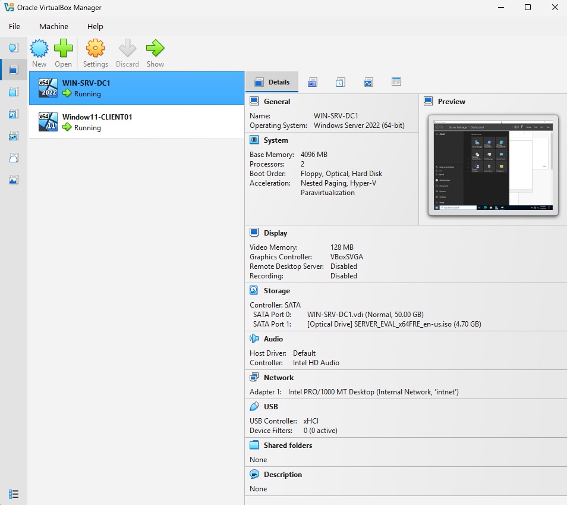
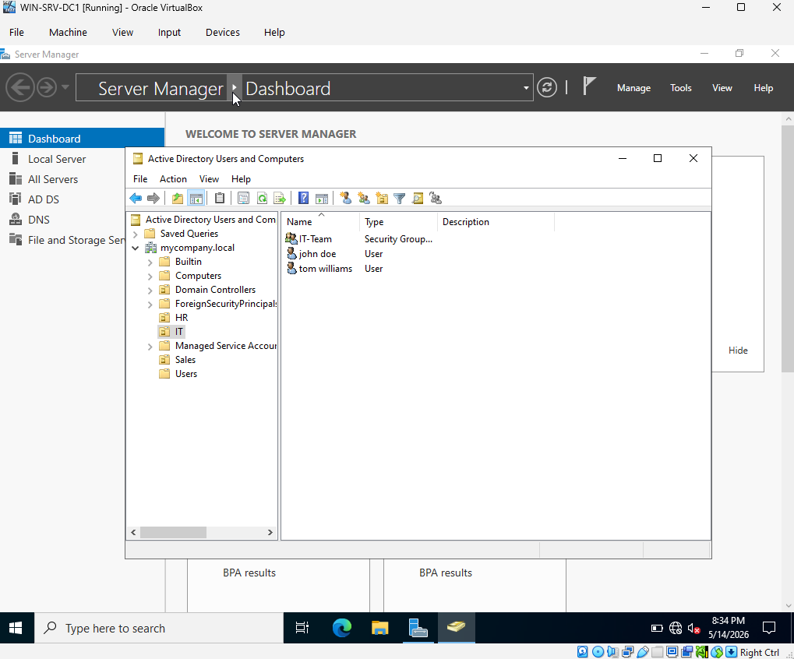
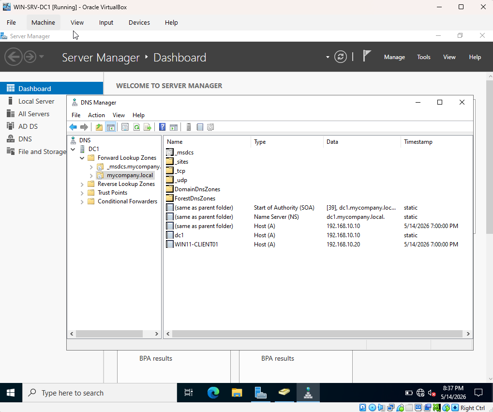
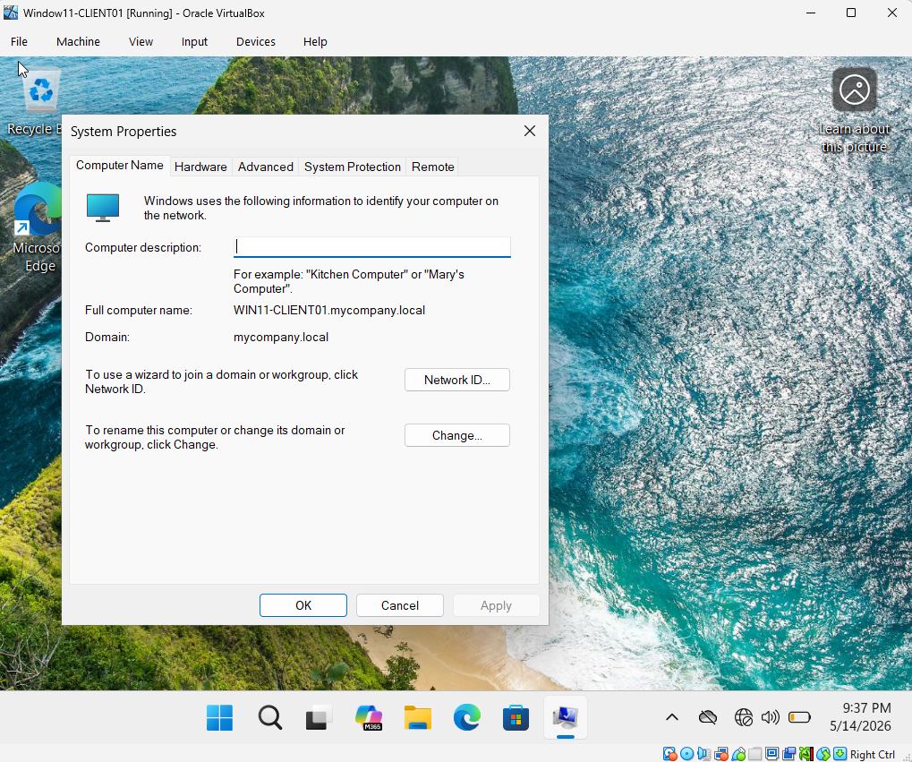

# Enterprise-Active-Directory-Lab

## Overview
This project simulates an enterprise Active Directory environment using Windows Server 2022, DNS services, and domain-joined Windows 11 client machines within VirtualBox.

## Project Objective
- Simulate a real-world enterprise Windows domain environment
- Deploy Active Directory Domain Services (AD DS)
- Configure DNS services
- Join Windows 11 client systems to the domain
- Perform basic enterprise administration and operational simulations

## Project Tasks
- Install VirtualBox
- Install and configure Windows Server 2022
- Install and configure Windows 11 Pro
- Configure DNS services
- Create Organizational Units (OUs) and domain users
- Configure and assign static IP addressing
- Join Windows 11 clients to the domain

## Technology Stack
- Windows Server 2022
- Windows 11 Pro
- Active Directory Domain Services (AD DS)
- DNS
- VirtualBox

## Network Configuration
### Domain Controller
- Hostname: DC01
- IP Address: 192.168.10.20

### Domain
- mycompany.local

### Client Device
- Hostname: WIN11-Client01
- IP Address: 192.168.10.20

## ScreenShots

### VirtualBox Lab Environment Running

### Active Directory Users and Computers

### DNS Configuration

### Active Directory Domain Integration

